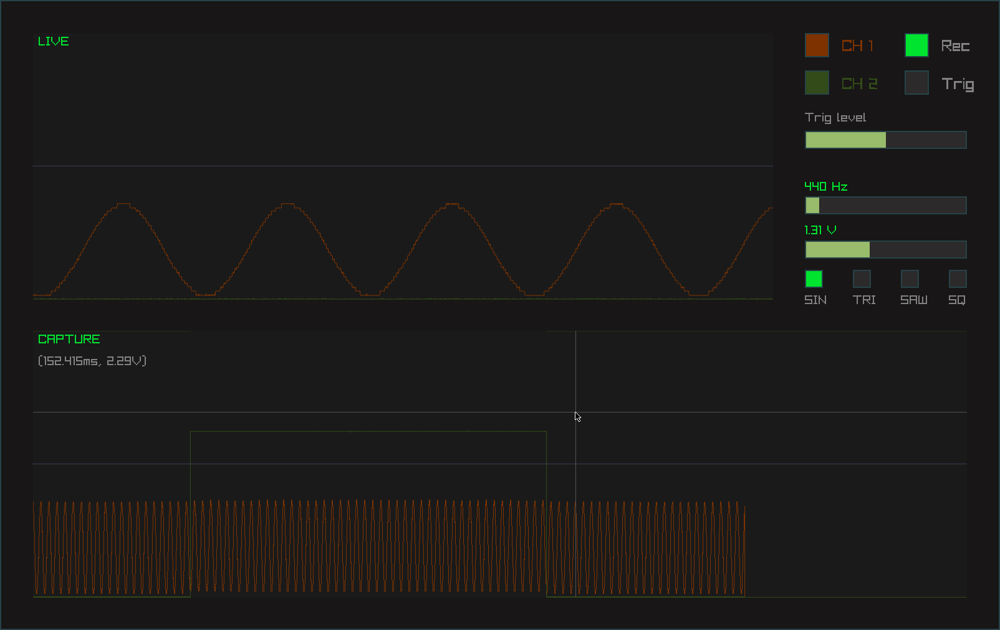
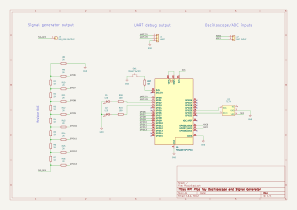

# About
This was my project for learning embedded programming with Raspberry Pi Pico
and a little bit of SIMD programming.
The project implements the firmware for a Raspberry Pi Pico with
[RP2040](https://datasheets.raspberrypi.com/pico/pico-datasheet.pdf) micro-controller,
that communicates over USB with a graphical user interface running on a PC,
currently limited to Linux.

The project consists of three parts:
* t4co: some tools for producing the final binary for the Pico
* pico: program for the Pico
* gui:  graphical interface


# Features
* Two 8-bit channels with a sample rate of 500ksps.
    + 250ksps per channel, when both are active.
    + Live view and recording of captured samples.
    + Triggered recording.
* Function generator:
    + sine, triangle, saw and square waveforms
    + adjustable frequency and amplitude
* Additionally supported (by default disabled):
    + Communication over UART for debugging.
    + Temperature reading from external
    [sensor](https://ww1.microchip.com/downloads/en/DeviceDoc/21462D.pdf) over I2C.


# Build
To build the project you will need the `arm-none-eabi-gcc` cross compiler
and the usual x86-64 `gcc` compiler toolchains.
The GUI also depends on [`libusb-1.0`](https://libusb.info) and
[`raylib`](https://github.com/raysan5/raylib).
You should be able to find `gcc`, `arm-none-eabi-gcc` and `libusb-1.0` development files,
available in your distribution's package repository:

```
sudo apt install gcc gcc-arm-none-eabi libusb-1.0-0-dev     # Ubuntu
```
```
sudo dnf install gcc arm-none-eabi-gcc libusb1-devel        # Fedora
```
```
sudo xbps-install gcc cross-arm-none-eabi-gcc libusb-devel  # Void Linux
```

Example of how to download and compile this project together with `raylib`
(make sure you have installed `raylib`
[dependecies](https://github.com/raysan5/raylib/wiki/Working-on-GNU-Linux)):
```
git clone --depth 1 --branch 5.5 https://github.com/raysan5/raylib.git
cd raylib/src
make
cd ../../

git clone https://github.com/jbrglez/pico-oscilloscope.git

# Let the pico-oscilloscope build script know the location of raylib files with:
ln -s "$(pwd)/raylib/src" pico-oscilloscope/gui/src/raylib
#  or
export RAYLIB_INCLUDE_DIR="$(pwd)/raylib/src"
export RAYLIB_LIB_DIR="$(pwd)/raylib/src"

cd pico-oscilloscope
./build.sh
```


# Flash and run
To flash the Pico:
1. Mount the Pico in BOOTSEL mode as a USB drive:
    1. Press and hold the BOOTSEL button on the Pico.
    2. Connect the Pico to your computer with a USB cable.
    3. Release the BOOTSEL button.
2. Copy the `pico/build/oscilloscope.uf2` file to the mounted drive (RPI-RP2).

You should also add the udev rules, to be able to access the Pico
without sudo privileges when you run the GUI.
```
sudo cp misc/55-rpi-pico.rules /etc/udev/rules.d
sudo udevadm control --reload && sudo udevadm trigger
```

Finally you can run the GUI:
```
./gui/build/oscilloscope
```
If you get "Permission denied" error, try reconnecting the USB cable or rebooting the PC.




